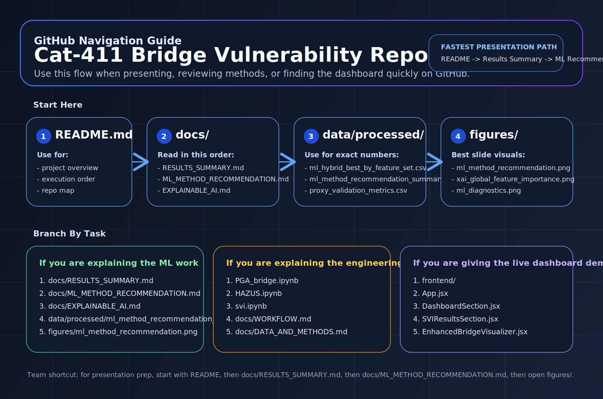

# GitHub Navigation Guide

Use this page when you want a fast visual guide to the repository structure on GitHub.

## Quick Paths

### If you need the project overview first
1. `README.md`
2. `docs/RESULTS_SUMMARY.md`
3. `docs/ML_METHOD_RECOMMENDATION.md`

### If you need the exact ML numbers
1. `data/processed/ml_hybrid_best_by_feature_set.csv`
2. `data/processed/ml_method_recommendation_summary.csv`
3. `data/processed/ml_method_recommendation_top5_no_pga.csv`
4. `docs/ML_HYBRID_ANALYSIS.md`

### If you need slide visuals
1. `figures/ml_method_recommendation.png`
2. `figures/xai_global_feature_importance.png`
3. `figures/ml_diagnostics.png`
4. `figures/xai_svi_ndvi_role_summary.png`

### If you need the engineering workflow
1. `PGA_bridge.ipynb`
2. `HAZUS.ipynb`
3. `svi.ipynb`
4. `docs/WORKFLOW.md`

### If you need the live dashboard demo
1. `frontend/`
2. `frontend/src/App.jsx`
3. `frontend/src/components/sections/DashboardSection.jsx`
4. `frontend/src/components/sections/SVIResultsSection.jsx`
5. `frontend/src/components/visuals/EnhancedBridgeVisualizer.jsx`

## Best Presentation Order

For a professor or team walkthrough, the cleanest order is:

1. `README.md`
2. `docs/RESULTS_SUMMARY.md`
3. `docs/ML_METHOD_RECOMMENDATION.md`
4. `docs/EXPLAINABLE_AI.md`
5. `figures/`
6. live demo from `frontend/`
